This April, I took an early-season backpacking trip to Schwyz, Switzerland, on the shores of Lake Lucerne. My not-very-thought-out plan (because I planned it all the night before), was to hike the [Schwyzer Höhenweg](https://schweizmobil.ch/en/hiking-in-switzerland/route-63). It seemed like the perfect destination because it summitted three relatively low-elevation peaks in the foothills of the alps which would be snow-free but give great views of the big, snow-capped mountains like the Jungfrau. Not everything went according to plan, however.

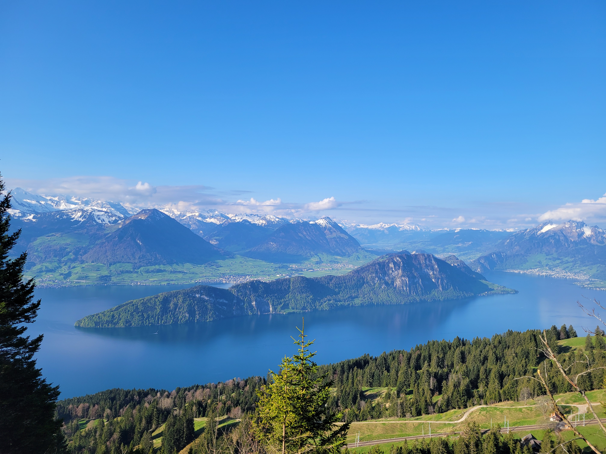

## Day 1: Munich to Rigi

I made my way to the train station in Munich and hopped on the direct train to Zurich. Because I planned everything last minute, I had not bought any train tickets. I assumed my Deutschland ticket, which provides free travel on all regional trains in Germany, would cover me to the border.

However, as soon as the train started moving, I realized that it obviously wasn't a regional train because it was going straight to Zurich. I checked ticket prices and they were almost 100€ for the 3-hour journey. I knew I also had to take a few more trains to get to the start of the route in Küssnacht which would also be expensive, so I had the brilliant idea to just buy a Swiss Travel Pass, which cost 300€ but would cover all travel in Switzerland for 3 days.

Soon after, the attendant came by to check my ticket. I showed her my new, very expensive Swiss Travel Pass, but she just shook her head. "We are not in Switzerland," she said, "This is Germany. That ticket is not valid here." In my defense, I was really tired that morning. The attendant luckily didn't make me pay a fine like usual, but she did make me buy the 80€ ticket to the Swiss border right there.

So within 30 minutes of starting my cheap backpacking trip, I'd already spent more money than I planned for on the whole trip, and it wasn't over yet. An hour and a half later, my phone buzzed with a text from my cellphone provider: "Dear Customer, the monthly maximum amount of EUR 59.50 for data roaming has almost been reached." I hadn't even been using my phone -- I'd been reading my book, and I thought I was still in Germany, so my phone should not have been using any roaming data. But 30 seconds later, I received another text: "Dear Customer, you have reached the monthly data roaming limit of EUR 59.50 in Andorra, the Isle of Man, and Switzerland. To protect you from further charges, mobile data usage in these countries is blocked for the remainder of the month." And 5 minutes after that: "Welcome to Switzerland."

Somehow my phone had used 1GB of roaming data in 30 seconds before I even reached the Swiss border, which is especially shocking because I only use 2GB of data total per month. I also didn't know that Switzerland wasn't covered by my plan because it isn't in the EU. Just as I realized all this, an announcement came over the loud speakers: "Due to technical difficulties on the track ahead, this train will be stopping at the border. All passengers must disembark and transfer to another train."

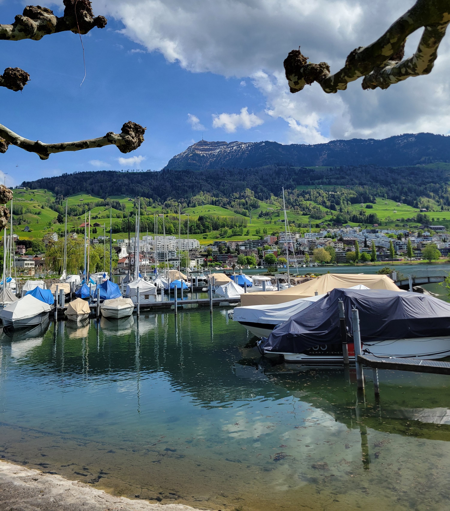

So what should have been a simple, three-hour train journey to Zurich cost me 450€ and didn't even get me into Switzerland. I had to transfer to a slow, regional train to get to Zurich and then took two more trains to get to the start of my route in Küssnacht am Rigi. From there, my destination for the night was the top of the Rigi mountain.

Side note: if you want a good reason not to learn German, just try to talk to locals about the Rigi mountain. Most locals refer to Rigi as a female with "die Rigi" because she is also known around town as "Queen of the mountains." However, the town is called Küssnacht am Rigi which implies Rigi is masculine and should be referred to as "der Rigi." An unfortunate feature of German is that the gender of the noun changes how you talk about it, so it gets very confusing for someone new to the language like me when people don't even agree on the gender of the thing.

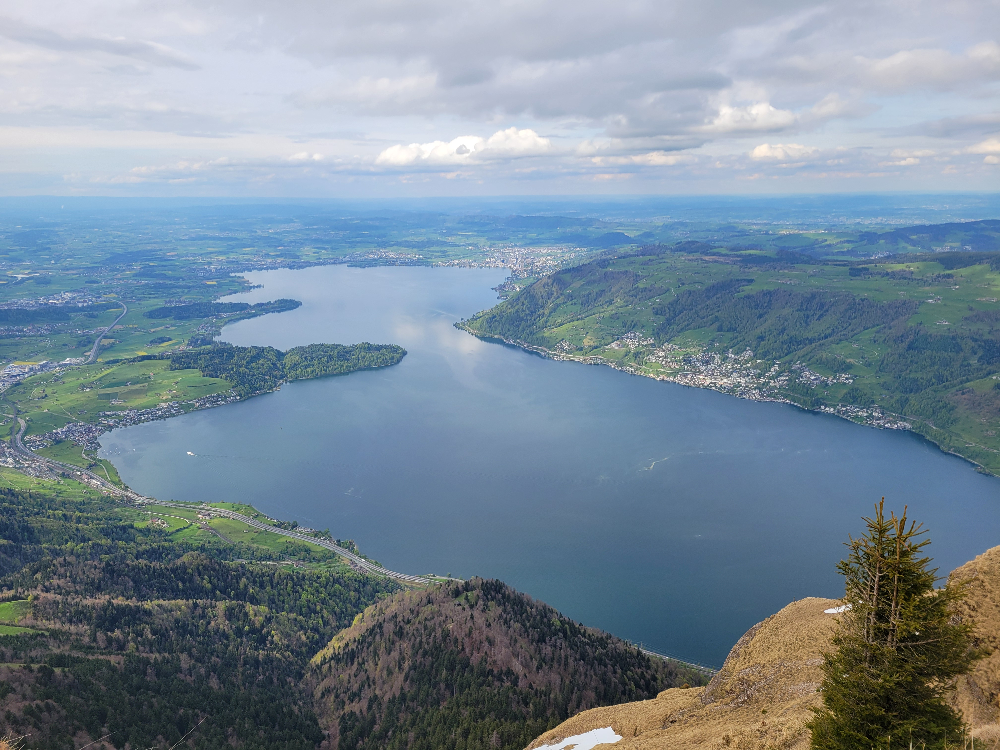

I arrived in Küssnacht later in the afternoon than I was planning, so I decided to take advantage of a cable car to start my hike halfway up the Rigi instead of at the base. Hiking in Europe makes a person much lazier than in America. From there, it was a quick two hours to the summit. I made it up there around 6 p.m., and the light on the surrounding hills and lakes was beautiful.

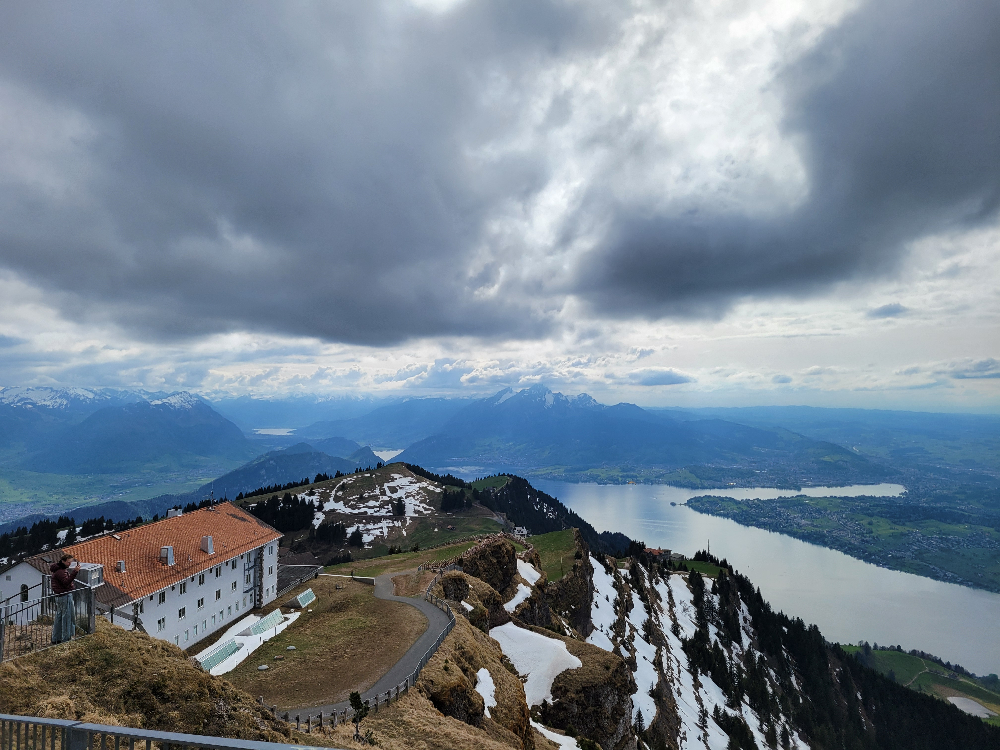

I then hiked down 1000ft to the town of Rigi Kaltbad, where I found a hostel for the night. A nice but terrible feature of the Alps is that there are cable cars, trains, and towns on almost every mountain, which means you can summit a peak and have pizza and a beer at the top, but which also makes hiking feel completely pointless, just like the tent I had hauled with me but realized was not allowed on pretty much the whole Schwyzer Höhenweg.

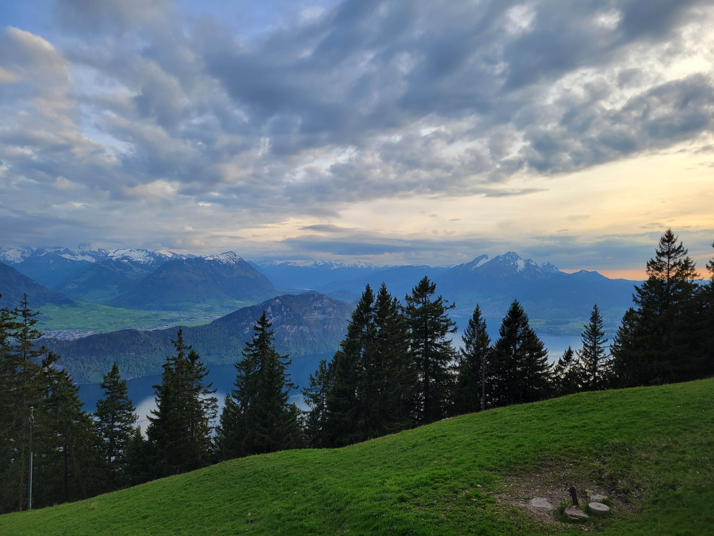

But the hostel was nice and I caught a great sunset.

Day 1 Stats:

- Trains: 5
- Cable Cars: 1
- Hiking elevation: +2701 -1333 feet
- Hiking distance: 5 miles
- Money spent: 550€

## Day 2: Rigi to ~~Sattel~~ Brunnen

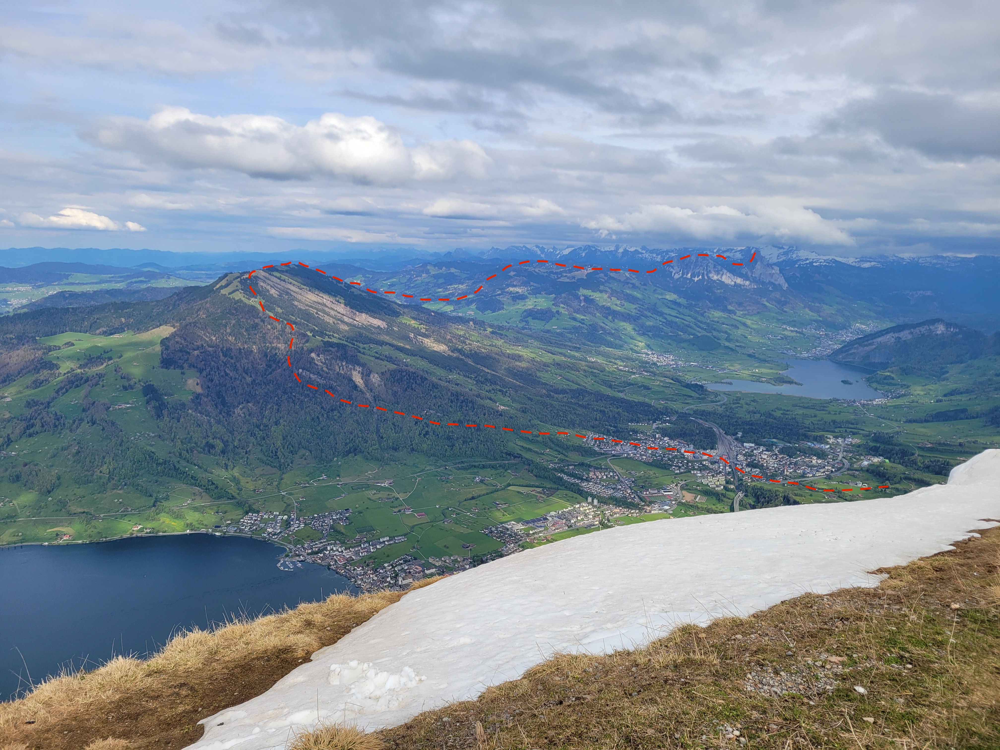

The next day, I woke up early because I had to hike the next mountain on the trail, the Wildspitz, and a big storm was forecasted to roll in around 3 p.m., so I wanted to be off the summit by then. The hostel breakfast didn't start until 8:30, so I unfortunately had to skip it, but the very nice lady who was cooking let me take bread with hummus and tomato, an apple, and some chocolates for the road.

I hiked down 600ft, but then I got worried I would be stuck in the storm on the next peak, so I lazily took the train the rest of the way down the Rigi into the town of Goldau. Then I hiked up the Gnipen, which was the only peak on the trail without any cable cars, so I had to use my legs. It was a beautiful morning and by far the best weather of the trip.

The Gnipen was the site of a landslide on September 2, 1806, when a huge face of the mountain broke off and decimated the town of Goldau below, burying 457 people. The slidepath is still the most obvious feature on the peak and looks surprisingly fresh because it has never been stable enought to heal.

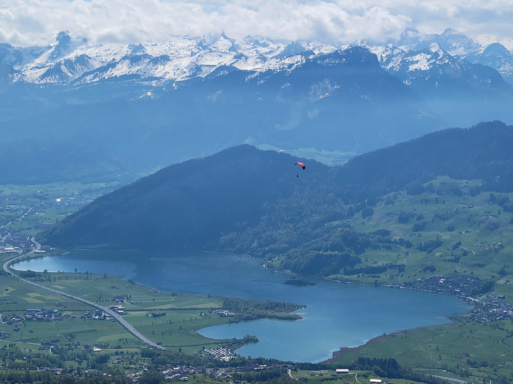

From there I traversed the ridge to the Wildspitz and then down through farms to the town of Sattel. This was supposed to be my camp spot for the night, but the storm that was forecast started to build over the peak I was planning to hike the next day, the Grosser Mythik. It was supposed to rain in the valley and snow up high all night and throughout the next day, making me question whether I really wanted to try and climb the Grosser Mythik in the rain, after it got snowed on all night. What cemented my decision was seeing that my tent site for the night was on the lawn of somebody's RV, so I pvioted and decided to bus to the nearby town of Brunnen, where I could tent camp on the shores of Lake Lucerne and do a nice lake hike in the rain the next day.

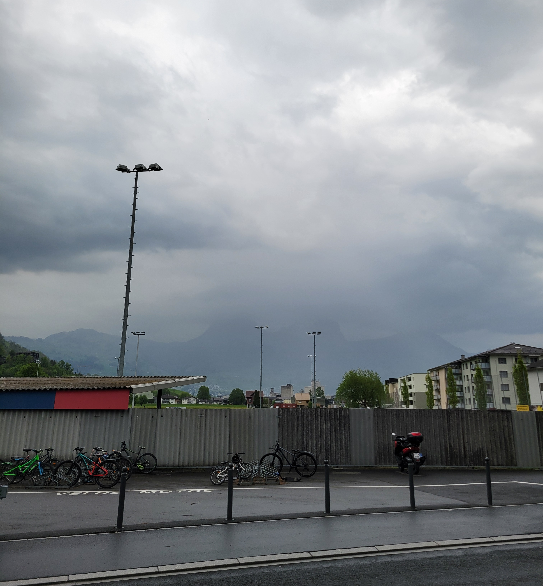

I wish I had decided just a little bit earlier, because the storm hit and started dumping rain one minute before I set up my tent, which soaked everything before I could get the rain fly on. I also got very wet and very cold, so I went to take shelter by the desk of the RV camp I was staying at.

There was a very nice lady at the front desk who took pity on me and made me a drink she said would warm me up, which turned out to be hot water with coffee and a lot of Schnapps. It did warm me up, and I went to bed with a pleasant burn in my stomach.

Day 2 Stats:

- Trains: 1
- Buses: 2
- Hiking elevation: +4400 -4200 feet
- Hiking distance: 9.4 miles
- Money spent: 10€

## Day 3: Brunnen to Brunnen on the Weg der Schweiz

The hike I decided on for the next day was the [Weg der Schweiz](https://www.wiegederschweiz.ch/erlebnisse/wege/weg-der-schweiz), which is a hiking trail created to celebrate the 700th anniversary of the Swiss Confederation in 1991 and circles the southernmost arm of Lake Lucerne. The weather forecast was looking worse and worse, so I decided to do it as a day hike and then go back to Munich the day after. It was about 21 miles long but mostly flat with only 4600 ft of elevation, so it seemed doable.

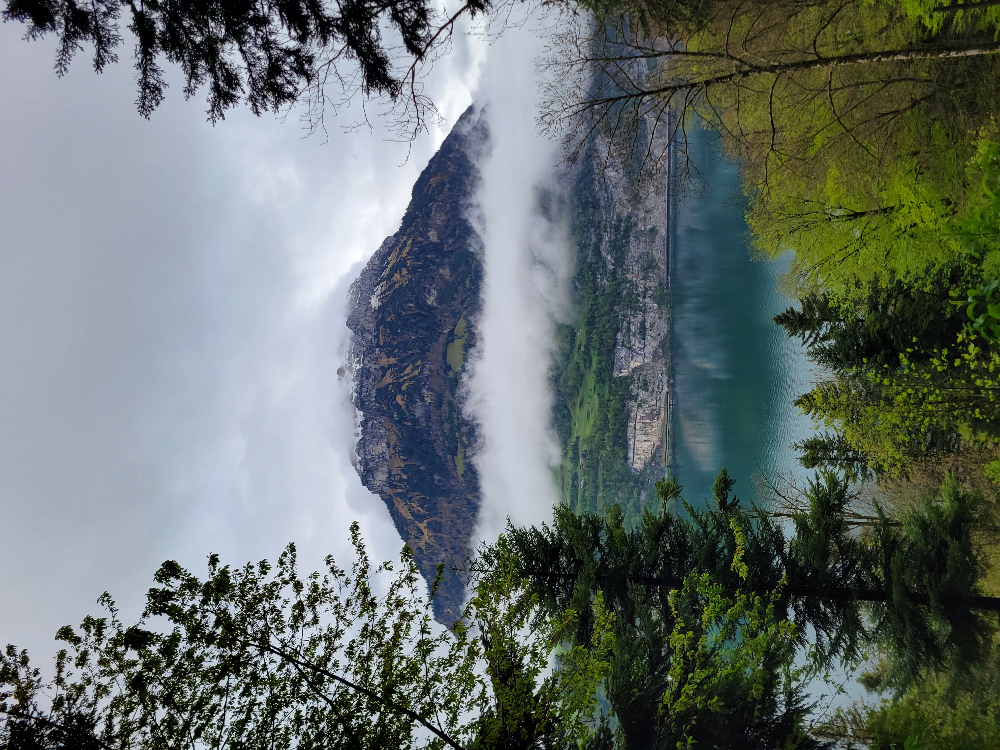

I woke up and took the first ferry at 8:30 a.m. from Brunnen to Rütli to start the hike. The trail started with a nice forest hike on a dirt path onto a bluff above the lake. This is what I expected the entire hike would be like based on the description on the website that the path "should be an example of careful treatment of nature and remain a modest place of encounter. The mountains, the lake and the magnificent views are its shaping elements to this day."

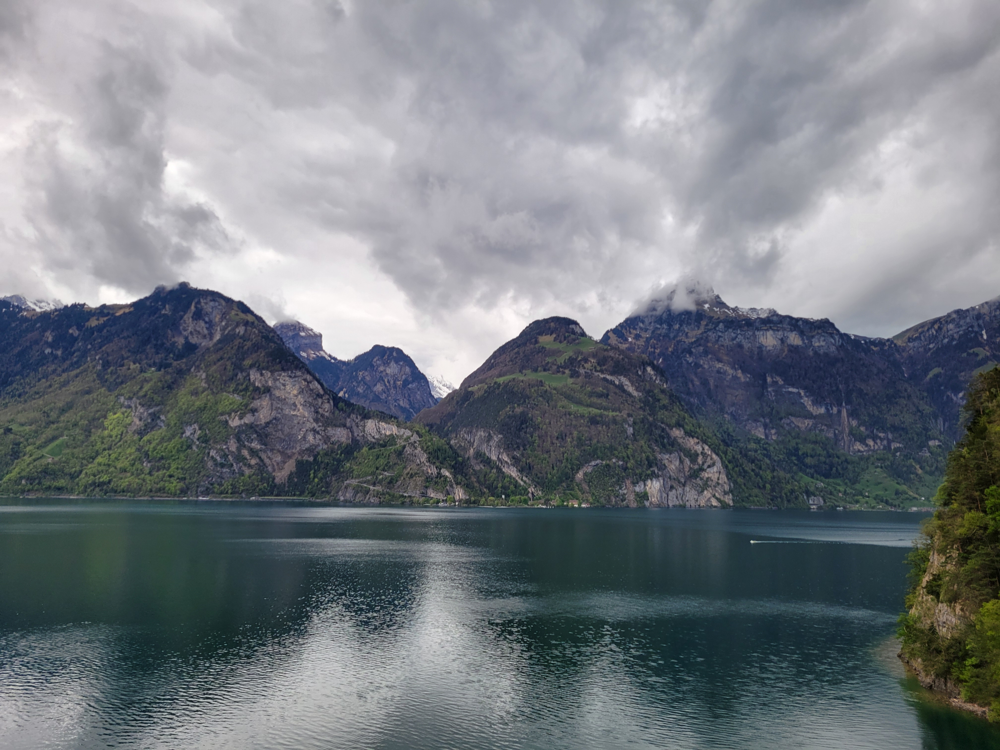

In reality, the quiet, forested trail was quite fleeting and most of the hike followed a massive highway that also circled the lake. It was obvious they had put a lot of time and money into building the path -- where the highway tunneled through cliff faces, they had also blasted a second tunnel just for pedestrians. I could admire the effort that went into it, and the views of the huge, glacier-carved peaks rising straight out of the lake were incredible, but at the same time it was 20 miles of road-walking mostly next to a loud, large highway, which detracted from the overall experience a lot.

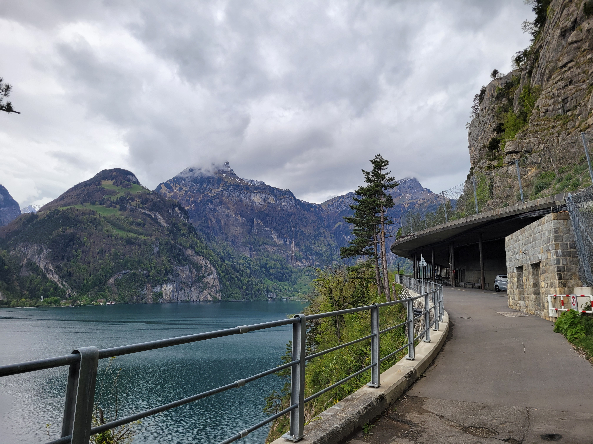

My legs were pretty tired, but I made it back to Brunnen at 6 p.m. and ate a huge pizza to recover.

Day 3 Stats:

- Ferries: 1
- Hiking elevation: +4100 -4100 feet
- Hiking distance: 23 miles
- Money spent: 20€

## Day 4: Brunnen to Munich

The next day was even more rainy and my legs were tired, so I went back to Munich. The return journey was less expensive but much more time-consuming because it was a Friday and the direct trains from Zurich to Munich were all fully-booked. I couldn't book a seat reservation with the Swiss Travel Pass, so I just got on a train, but there were probably a hundred people standing in the aisles and the entry ways because every single seat was reserved and the train was severely overbooked. With multiple screaming babies, lots of confused tourists yelling to each other across the throngs of people, and plenty of pushing as others tried to make their way to the bathroom or off the train, there was no way I was going to make it standing in the middle of it all for three hours, so I disembarked and spent the day taking lots of small, regional trains to get back to Munich, which was slow but had the benefit of being covered by the Deutschland ticket and not busy.

Day 4 Stats:

- Trains: 7
- Hiking: 0
- Money spent: 10€

## Final Thoughts

Switzerland is expensive. Next time, I will definitely plan my transportation better to avoid the costly mistakes I made this time. The food is also expensive and bad, so I ended up getting almost all my food from the grocery store, which I think was the move.

On the other hand, the mountains in Switzerland are absolutely incredible and make everything else worth it. It's hard to imagine anything better than seeing steep, snow-capped peaks rising 9000ft straight up from low valleys and lakes.

Even though I didn't end up hiking the whole path, I enjoyed the Schwyzer Höhenweg because it was mostly on trails, with good views and some cool summits. But the Weg der Schweiz represented everything wrong with outdoor recreation in the alps. It was a similar level of dissappointment to when I first saw the Eiger and found out that the mythical mountain had a train that tunneled through the face and actually had a stop halfway up with windows carved into the rock. I'll have to do better research in the future to find places with a little less infrastructure to avoid disappointment.
