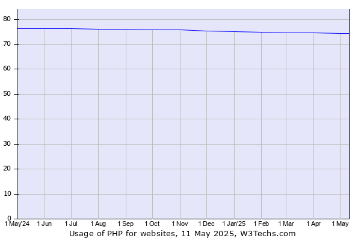
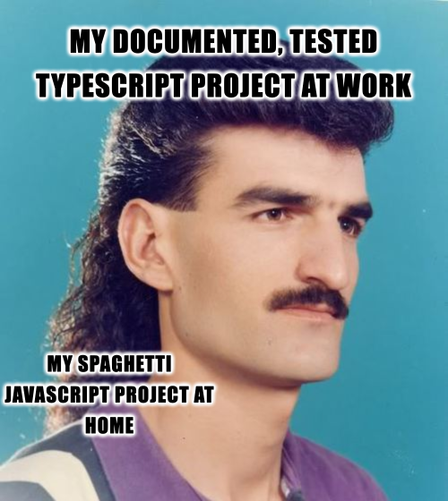

I have had a personal website since 2019, but over the years, it has gone through a lot of changes as I've torn it down, re-written it, and re-written it again to test out new coding languages and frameworks.

## My First Website

I first started building a personal website in 2019 when I was studying abroad in New Zealand. The universities there focus more on exams than homework, so I found myself with a lot of free time when it wasn't exam season. In between hikes, I took a couple of online web development classes where I learned about HTML, CSS, Javascript and libraries like JQuery. That first version of my website was built in PHP, which I actually enjoyed using, but the developer community has moved away from in recent years. Amazon [banned PHP](https://muldoon.cloud/programming/2020/04/17/programming-rules-thumb.html#rule-9-use-php-or-hack-if-you-want-to-test-server-changes-without-rebuilding) internally in 2015 because teams kept running into security issues with old versions of the language, and it was a joke when I worked there to suggest PHP as the language to use for new projects. Despite this, PHP still runs [74.3%](https://w3techs.com/technologies/details/pl-php) of the web as of May 2025:

Although a lot of that usage is thanks to website-builder platforms like WordPress, which powers [43.6%](https://w3techs.com/technologies/details/cm-wordpress) of all websites and is built in PHP.

I never had a vendetta against PHP, but I have always used my website more as a fun side project to learn new things than as an actual blog (which you can probably tell based on how few posts I have), so I eventually tore down my old site and decided to rebuild it with a modern tech stack.

## Other Iterations

I did a lot of local re-building and tearing down before I got to this latest version of my site. In 2021, I re-made my old site using a MEAN stack, which stands for **M**ongoDB, **E**xpress, **A**ngular, and **N**ode. Learning these new tools was great, because I'd heard people talk about MongoDB and Node a lot but had never used it at that point, and using Node with Express was a very different experience than PHP.

Working at a big company like Amazon did give me a hatred for dynamically typed languages when they are used for large projects because it quickly becomes very difficult to figure out what type of data any function is dealing with, but I love them for small, personal projects like this. So at work I prefer Typescript, but at home I go for Javascript.

However, around 2022 everyone started talking about this new language called Rust. Apparently, it was fast and safe because it used an ownership memory model to achieve compile-time verification of memory and concurrency safety. At AWS, several big components were being [rewritten](https://aws.amazon.com/blogs/opensource/why-aws-loves-rust-and-how-wed-like-to-help/) in Rust.

I decided I needed to try it for myself, so I worked through the [Learn Rust](https://doc.rust-lang.org/book/) book and started re-building my website backend with it. The ownership model in Rust makes it unlike any other language I've used, and I still find it un-intuitive to write code in, but it was very satisfying getting it to work.

Because I was new to the language and found it difficult to write in, I wanted my website to be very simple. I would write my blog posts in Markdown, and then a backend component would translate the Markdown to HTML, and then the server would serve the plain HTML pages.

This was fun to build and I learned a lot about Rust from it, but it also didn't really make sense running all of that just to serve a static site.

## The Current Website

This year, I heard about [static site-generators](https://www.cloudflare.com/learning/performance/static-site-generator/) and realized my little rust project was basically a really bad version of them. At the same time, my girlfriend gave me an idea for a new blog theme: "Will or Won't", so I completely re-made my website again using the new theme and the static site-generator [Eleventy](https://www.11ty.dev/docs/).

The biggest difference between a traditional web site and a static site built with a static site-generator is that traditional webpages are built on-demand by the server each time a user visits the site, whereas static site-generators create HTML pages at build time and the same pages are sent to every user, so there is no need for a server to render the page. This means static sites can be hosted fully on a Content Delivery Network (CDN) and immediately sent to users. This comes with a few pros and cons.

Pros:

- **Performance** - static sites load faster and are easier to scale because the pages are all created in advance.
- **Simplicity** - you don't need to host any special languages or databases to run a static site. This also makes them safer because there's no backend to attack.
- **Cost** - you don't have to pay for a database or special servers to host your website. It can all be served on a CDN.

Cons:

- **Not user-friendly** - most static site-generator frameworks require some development experience to use and lack pre-built templates, so they are not as easy as CMS tools like WordPress.
- **No dynamic content** - static sites don't have a backend server, so they can't do anything dynamic like updating databases or showing different content to different users.

Most sites can't be static because they need to do a lot of stuff for their users, but for simple things like documentation or blogs (like this one), it's perfect. You can see all the code for this blog on my [Github](https://github.com/willBennatt/blog2025).

## Final Thoughts

My website has evolved a lot over the years, but I really like this latest version, so maybe this is the one I will finally start writing blog posts for.
