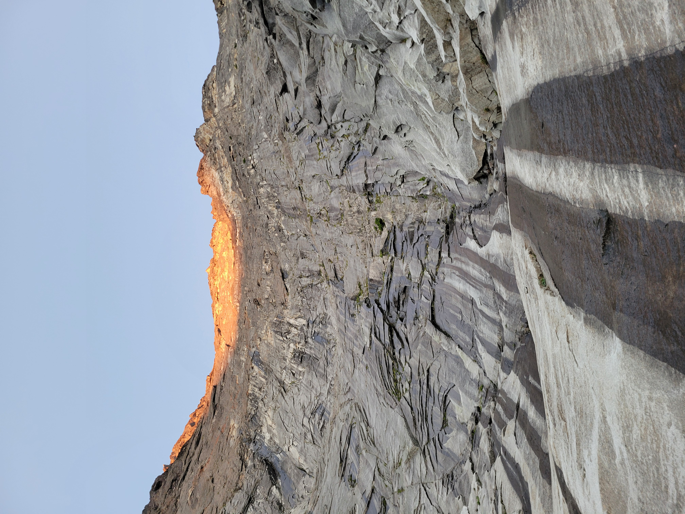

In September 2024, I finally climbed all three\* of the great north ridges of the Cascades: the NE Buttress of Goode (5.5), the North Ridge of Stuart (5.9), and the NE Buttress of Slesse (5.9).

The asterisk is that they are not all strictly north ridges since two of them are north-east buttresses, and there are a lot of other awesome north ridge routes in the Cascades, like the North Ridge of Baker, Liberty Ridge on Rainier, the North Ridge of Forbidden, the North Buttress of Bear, etc etc, but these three are some of the biggest, coolest, and most classic alpine rock routes in the range.

I haven't included full trip reports for each climb, because just one trip report for any of these mountains could fill 10 pages. Maybe I'll write those later, but for now I only selected a few pictures to show the character of each climb.

## The NE Buttress of Goode

The first route I climbed was the NE Buttress of Goode in August of 2022 with my friends Joe and Henry. With a stout approach and descent including a small but spicy glacier, a remote feel, incredible views, and an even more incredible summit bivy, Goode is a full-value climb, despite the easier grade.

### Approach

The approach to Goode started smooth with a 10 mile downhill hike along a section of the PCT, but the going quickly got more difficult after we turned off the PCT into a less-traveled valley toward the mountain.

The plants closed in and it became difficult for us to spot each other through the thick brush. But eventually we broke out of the overgrowth and found ourselves on the talus below Mt. Goode.

The fun wasn't over yet though. We had to tunnel through thick alder slides to bypass waterfall-covered cliffs before we arrived at our camp below the Goode Glacier.

### Climb

To get on the rock, we first had to cross the broken and dying Goode Glacier. Sometimes the crux of the whole route is crossing the glacier's bergschrund to get onto the rock, but luckily we found a relatively safe crossing point.

Once on the rock, we simulclimbed to the summit in 4 or 5 hours.

The Goode summit is a small but flat circle that makes for a perfect bivy, but we arrived on top around 2 p.m., and with no shelter from the hot sun up there and a long hike out the next day, we decided to start our descent.

### Descent

We made camp on some beautiful heather benches below the summit.

The next day we descended the mountain and then had a long, hot walk back to the parking area. All told, I think getting from the summit back to the trailhead was about 24 miles and an elevation loss of 7000 feet.

## The North Ridge of Stuart

One week later, Joe and I went back out and climbed the North Ridge of Stuart. This is the most-classic alpine rock route in Washington and my favorite. Steep climbing on a beautiful, clean granite ridge the cuts through two hanging glaciers makes this a must-do route.

### Approach

We approached from Ingalls Lake. It was a cold, gray day.

We climbed the full (direct) north ridge. We planned to get on the route that first day, but when we got to the base, we found a line of people with the same idea. We ended up bivying in the talus below the base that night instead.

### Climb

The climb starts with a nice 5.9 crack before easing into less difficult terrain for a thousand feet or so.

There is a large ledge at the halfway mark. After that, the really cool climbing starts.

### Descent

The descent is a long, hot, and dusty trek down the Cascadian Couloir. We were very motivated to get to the cold water of Ingalls Creek at the bottom.

Then we hiked back up and over Long's Pass to the trailhead.

## The NE Buttress of Slesse

In September 2024, I finally climbed Slesse, the last of the three great north ridges, with my friend Manny Pacheco. The NE Buttress of Slesse is one of North America's 50 classic climbs for good reason. It is big, remote, and exposed.

### Approach

We spent the first day driving out to the trailhead and then hiked up to bivy at Propeller Cairn, which was the site of one of the [deadliest aviation disasters](https://en.wikipedia.org/wiki/Trans-Canada_Air_Lines_Flight_810-9) in Canadian history.

### Climb

We woke up early the next morning and headed to the base of the route.

We started climbing around 6:00 a.m., but lost time early on due to some route-finding shenanigans, which would turn into a theme on this trip.

I started up the wrong crack on the first pitch and got into some sketchy terrain with a lot of loose blocks, but luckily managed to rappel and get back onto the right route.

After that, we climbed for about 7 hours straight to make it to the halfway ledge, which included us accidentally doing the direct 5.10 variation straight up a huge overhang.

We arrived on the halfway ledge around 3 p.m. and decided there was more than enough daylight to keep climbing. However, we hadn't done as much research as we probably should have and thought there would be some more good ledges to sleep on higher up the route. So we just kept climbing, waiting for a good ledge to appear, but none did, and eventually it started getting dark. But we just put on headlamps and kept climbing, holding out for the right ledge. We finally made it to a good one around 9:30 p.m. The light was gone, and we had no idea where we were on the route at that point, but I thought we were maybe three-quarters of the way up the ridge and would have quite a bit more climbing to do in the morning, so you can imagine my surprise when we woke up practically on the summit.

### Descent

There were two options for the descent: we could do a long ridge scramble and then 10 rappels to get back to our car at the trailhead, or we could hike a trail down the opposite side of the mountain into a different valley and hope we could hitchhike back to our car. We were both mentally tired of being on exposed rock at that point, so we opted to hike the trail down into the other valley.

It all worked out and some nice fellow climbers gave us a ride back to our car.

## Final Thoughts

Climbing these three big routes in the Cascades had been a goal of mine since I climbed my first alpine route, and I'm very thankful I got the chance to do them before I moved out of Seattle. They met all of my expectations.
