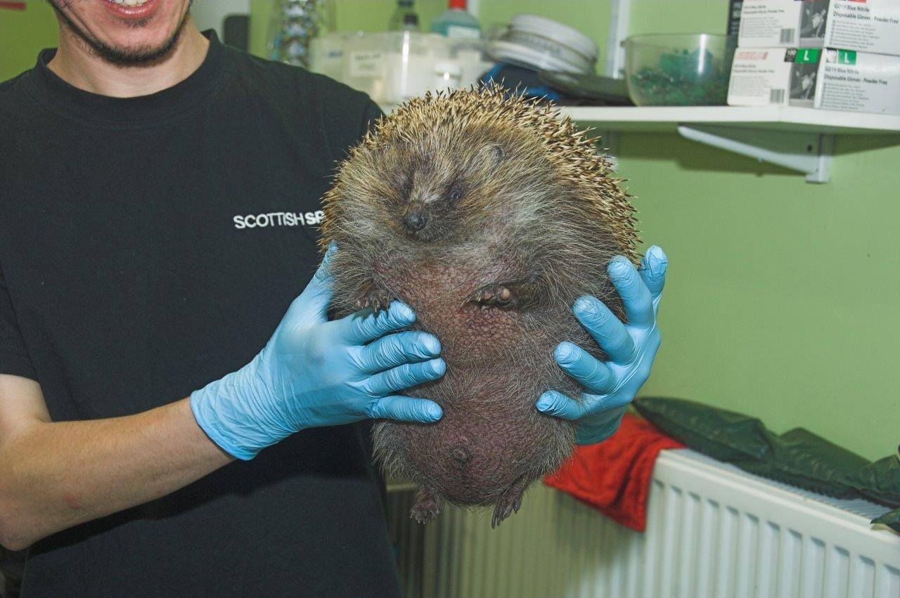

These are my favorite animals ranked by their speed, stamina, and strength.

“No one appreciates the very special genius of your conversation as the dog does.” — Christopher Morley

## 1. [Tiger](https://en.wikipedia.org/wiki/Tiger)

- Speed: 9
- Stamina: 9
- Strength: 9

The tiger is the animal I would be most terrified to run into in the wild, which gives it the number one spot in the rankings. Tigers have been seen taking down elephants on their own. And when they see humans as prey, they can be profilic killers, like the [Champawat Tiger](https://en.wikipedia.org/wiki/Tiger_attack) which killed 436 people in Nepal and India.

## 2. [Leopard](https://en.wikipedia.org/wiki/Leopard)

- Speed: 9
- Stamina: 9
- Strength: 8

The leopard is similar to the tiger for me in that if there was one hunting people, I wouldn't want to be within 200 miles of it. Sneaky and strong, one has even been spotted killing a young giraffe and hauling its carcass up a tree to cache it.

## 3. [Hippo](https://en.wikipedia.org/wiki/Hippopotamus)

- Speed: 5
- Stamina: 6
- Strength: 10

When I first saw a hippo at the Woodland Park Zoo in Seattle, I thought they looked really weird. They appear really fat at first glance, but it's all muscle, so they must be really strong. I also like how they just hang out in the water all day, because I like doing that too.

## 4. [Polar Bear](https://en.wikipedia.org/wiki/Polar_bear)

- Speed: 6
- Stamina: 10
- Strength: 9

The Polar Bear may be ranked number 4, but it is the number 1 animal that I would like to see in the wild. Everything new I learn completely changes my picture of them. They spend enough time in the water to be considered a marine mammal, and swim for an average of 3.5 days at a time. They hunt blubber-rich prey like seals, walruses, and even beluga whales and narwhals. They are also pretty scary.

## 5. [Hedgehog](https://en.wikipedia.org/wiki/Hedgehog)

- Speed: 2
- Stamina: 3
- Strength: 1

It may not be the strongest, but it is really cute. I like seeing hedgehogs. I also feel bad for them because they can suffer from balloon syndrome, a condition in which gas gets trapped under their skin and they inflate like a balloon.

## 6. [Elephant](https://en.wikipedia.org/wiki/Elephant)

- Speed: 6
- Stamina: 6
- Strength: 10

The largest living land animals, elephants have always captured my fascination and respect. They are very smart, have complex social structures, and practice rituals for their dead. They are the original gentle giants - they just want to live their lives, but if someone messes with them, they will aggressively defend themselves.

## 7. [Dire Wolf](https://en.wikipedia.org/wiki/Dire_wolf)

- Speed: 8
- Stamina: 7
- Strength: 6

Now that these [exist again](https://edition.cnn.com/2025/04/07/science/dire-wolf-de-extinction-cloning-colossal), they have to be in the top 10. Like a regular wolf but bigger and cooler.

## 8. [Sloth](https://en.wikipedia.org/wiki/Sloth)

- Speed: 0
- Stamina: 1
- Strength: 3

I saw this sloth at the Munich Zoo, and he moved way more than I ever expected a sloth to move. He loved climbing over the crowd and showing off by hanging from his toes. That earned him an easy spot in the top 10.

## 9. [Glass Lizard](https://en.wikipedia.org/wiki/Sheltopusik)

- Speed: 1
- Stamina: 2
- Strength: 0

I had no ideas these things existed until this week. At first I thought they were snakes, but the way they move is more like a crazy wiggle/roll than a slither. It turns out they are European Legless Lizards, and they are lizards that evolved to have no legs. I think these two were a little more than friends because they were acting crazy and were very intermingled before I took this picture.

## 10. [Narwhal](https://en.wikipedia.org/wiki/Narwhal)

- Speed: 7
- Stamina: 6
- Strength: 5

Narwhals just look really cool. Narwhal horns gave rise to the unicorn myth, but I think whales with horns might be even cooler.

## Final Thoughts

Those are my top 10 favorite animals ranked by their speed, stamina, and strength, although some got an extra boost in the rankings if I really liked them.
